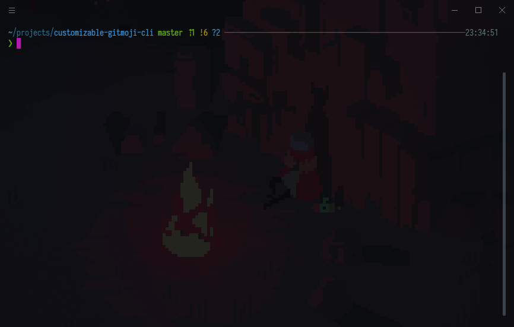

<h2 align="center">customizable-gitmoji-cli</h2>

<p align="center">カスタマイズ可能な<a href="https://github.com/carloscuesta/gitmoji-cli">gitmoji-cli</a>!</p>

---

<p align="center">
<a href="https://www.npmjs.com/package/customizable-gitmoji-cli"></a>

<p>
<div align="center">

[](https://github.com/SnO2WMaN/customizable-gitmoji-cli/actions)
[](https://codecov.io/gh/SnO2WMaN/customizable-gitmoji-cli)
[](https://codeclimate.com/github/SnO2WMaN/customizable-gitmoji-cli/maintainability)

</div>
</p>

<p>
<div align="center">

[](https://www.npmjs.com/package/@conten2/eslint-config)
[](https://renovatebot.com/)
[](https://gitmoji.carloscuesta.me)
[](https://github.com/prettier/prettier)

</div>
</p>

<p>
<div align="center">

<!-- prettier-ignore-start -->
<!-- ALL-CONTRIBUTORS-BADGE:START - Do not remove or modify this section -->
[](#contributors-)
<!-- ALL-CONTRIBUTORS-BADGE:END -->
<!-- prettier-ignore-end -->

</div>
</p>

---

<p >

<div align="center">

[日本語](https://github.com/SnO2WMaN/customizable-gitmoji-cli/blob/master/README-jp.md) / [English](https://github.com/SnO2WMaN/customizable-gitmoji-cli#readme)

**この`README-jp.md`を「正しい」英語に訳してくれる人間を探しています。**

</div>

</p>

---

## インストール 📥

```bash
npm i -g customizable-gitmoji-cli

yarn global add customizable-gitmoji-cli
```

挙動について保証出来ないので、オリジナルの gitmoji-cli はアンインストールしてください。

```bash
npm uninstall -g gitmoji-cli

yarn global remove gitmoji-cli
```

## 使用方法 🧰

任意の git プロジェクトで以下のコマンドを叩いてください。

```bash
gitmoji init
```



コミット時に自動で gitmoji-cli が起動します。


## コマンド ⌨️

```
gitmoji v1.0.0

Usage:
  $ gitmoji <command> [options]

Commands:
  init            Initialize gitmoji as a commit hook
  remove          Remove a previously initialized commit hook
  commit          Interactively commit using the prompts
  list            List all the available gitmojis
  search [query]  Search gitmojis

For more info, run any command with the `--help` flag:
  $ gitmoji init --help
  $ gitmoji remove --help
  $ gitmoji commit --help
  $ gitmoji list --help
  $ gitmoji search --help

Options:
  -v, --version  Display version number
  -h, --help     Display this message
```

### init

コミット時に gitmoji プロンプトを起動するようにフックを掛けます。

### remove

コミット時に起動する gitmoji プロンプトを解除します。

### commit

gitmoji プロンプトをマニュアルで実行します。

特に理由がなければ `gitmoji init`でフックを掛けてください。

### list

`.gitmojirc`から利用可能な全ての gitmoji を列挙します。


### search

条件に合致する gitmoji を探します。


## コンフィグファイル 🔧

[cosmiconfig](https://github.com/davidtheclark/cosmiconfig)に基づいて、`.gitmojirc`などの設定ファイルを読み込みます。

### 例

```json
{
  "emojiFormat": "code",
  "autoAdd": false,
  "signedCommit": false,
  "titleMaxLength": 48,
  "presets": "base"
  "rules": [
    {
      "emoji": "🤡",
      "description": "Everything must go!!",
      "name": "clown_face"
    }
  ],
  "order": [
    "ok_hand"
  ],
  "scopes": ["frontend", "backend"]
}
```

### `emojiFormat`

コミット時に添付される絵文字のフォーマットを選択できます。

- emoji
  - 👌, 🐶, 🔪
- code
  - `:ok_hand:`, `:dog:`, `:knife:`

のどちらかを使用できます。

**デフォルト**： `code`

### `autoAdd`

コミット時に自動で`git add .`を実行します。

**デフォルト**： `false`

### `signedCommit`

署名付きコミットを行います。

**デフォルト**： `false`

### `titleMaxLength`

コミットメッセージの長さを設定します。72 文字以下で設定してください。

**デフォルト**： `48`

### `presets`

読み込む`gitmoji-presets`を列挙します。

**デフォルト**： `base`

**TODO:詳細は今後記載します。**

### `rules`

gitmoji を定義します。以下のように記載してください。

[ikatyang/emoji-cheat-sheet](https://github.com/ikatyang/emoji-cheat-sheet)は役に立つでしょう。

```json
{
  "emoji": "🦍",
  "description": "Feel good.",
  "name": "gorilla"
}
```

### `order`

順序を指定します。指定された gitmoji はより優先されます。

### `scopes`

選択できるスコープを列挙します。スコープを指定した場合、以下のようなコミットメッセージになります。

```
📷(scope) commit message.

:camera:(scope) commit message.
```

## Contributors 👥

以下の方々には感謝しかありません ([emoji key](https://allcontributors.org/docs/en/emoji-key)):

<!-- ALL-CONTRIBUTORS-LIST:START - Do not remove or modify this section -->
<!-- prettier-ignore-start -->
<!-- markdownlint-disable -->
<table>
  <tr>
    <td align="center"><a href="https://sno2wman.dev/"><br /><sub><b>SnO₂WMaN</b></sub></a><br /><a href="https://github.com/SnO2WMaN/customizable-gitmoji-cli/commits?author=SnO2WMaN" title="Code">💻</a> <a href="#maintenance-SnO2WMaN" title="Maintenance">🚧</a></td>
    <td align="center"><a href="https://renovatebot.com"><br /><sub><b>Renovate Bot</b></sub></a><br /><a href="#infra-renovate-bot" title="Infrastructure (Hosting, Build-Tools, etc)">🚇</a></td>
    <td align="center"><a href="https://carloscuesta.me"><br /><sub><b>Carlos Cuesta</b></sub></a><br /><a href="#ideas-carloscuesta" title="Ideas, Planning, & Feedback">🤔</a></td>
    <td align="center"><a href="https://twitter.com/0918nobita"><br /><sub><b>0918nobita</b></sub></a><br /><a href="https://github.com/SnO2WMaN/customizable-gitmoji-cli/issues?q=author%3A0918nobita" title="Bug reports">🐛</a> <a href="#security-0918nobita" title="Security">🛡️</a></td>
  </tr>
</table>

<!-- markdownlint-enable -->
<!-- prettier-ignore-end -->

<!-- ALL-CONTRIBUTORS-LIST:END -->

このプロジェクトは [all-contributors](https://github.com/all-contributors/all-contributors) に準拠しています。どのような貢献もお待ちしています！
